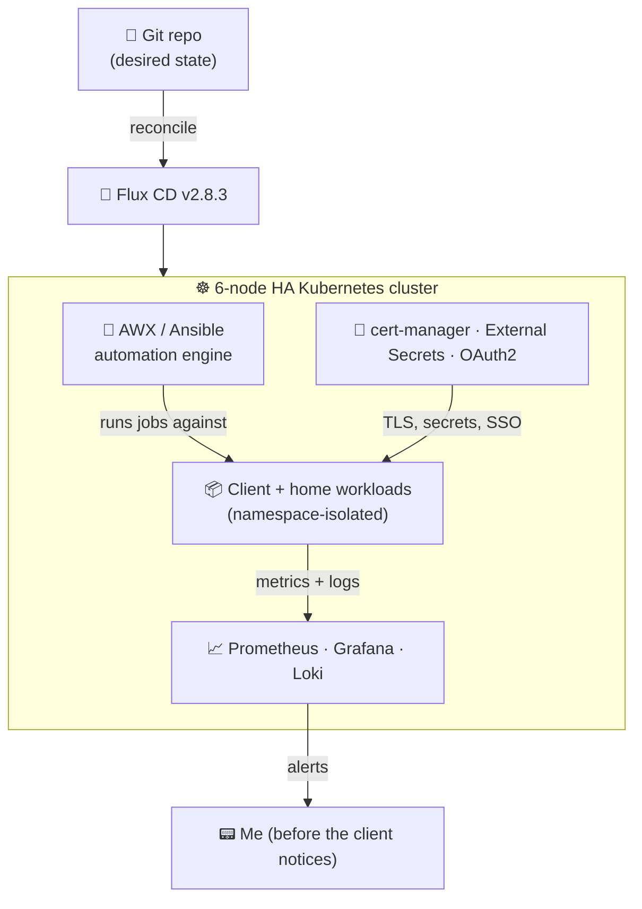

<h1 align="center">👋 Hi, I'm Riley Schuit</h1>

  <b>SRE / DevOps / Automation engineer.</b> I turn manual, error-prone work into infrastructure that runs itself. 
  I design self-service platforms, ship reliability (idempotency, monitoring, backups), and <b>treat documentation as a deliverable</b>.

  
  
  

  
  
  
  
  
  
  
  

---

## 🧭 Case study: I run a production-grade automation platform out of my house

Most "homelab" writeups are a screenshot of a Grafana dashboard. This is the real thing: a **6-node, high-availability Kubernetes cluster** that has been reconciling itself from Git and running around the clock since **April 2026** — no manual `kubectl apply`, no snowflake servers, nothing I can't rebuild from a repo.

I use it as the delivery engine for **done-for-you workflow automation**: the same platform that runs my house runs my clients' automations, each isolated, monitored, backed up, and documented — at near-zero marginal cost.

**If you're a business owner:** it means the automation I build for you doesn't live on my laptop or in a $200/mo SaaS tab you'll cancel. It runs on infrastructure that heals itself, alerts *me* before it alerts *you*, and comes with a runbook so you're never locked in.

**If you're hiring or evaluating me:** everything below is real, versioned, and reproducible. The numbers come straight off the cluster.

---

## 📊 The cluster, by the numbers

| | |
|---|---|
| **Nodes** | 6 (3 control-plane HA + 3 workers), Calico CNI |
| **Workloads** | 60+ Deployments across 30+ namespaces |
| **Source of truth** | 100% GitOps — Flux CD `v2.8.3` reconciles every workload |
| **Automation engine** | AWX `24.6.1` (Ansible) on `awx-operator`, Postgres 15, NFS-persistent |
| **Observability** | Prometheus + Grafana + Loki/Promtail, node-exporter on every node |
| **Uptime** | Continuous operation since April 2026 |
| **Storage** | NFS + Unraid array, per-PVC capacity monitored |
| **Security** | cert-manager TLS, External Secrets, OAuth2 SSO, Trivy image scanning, Pod Security Standards |

---

## 🏗️ How it fits together

The pattern is boring on purpose: **desired state lives in Git, Flux makes reality match it, everything is observed, and secrets never touch the repo.** Boring is what "reliable" looks like in production.

---

<b>🔧 The full stack (click to expand — for the engineers)</b>

### GitOps & platform
- **Flux CD `v2.8.3`** — source, kustomize, helm, and notification controllers. Every namespace is labeled with its owning Flux Kustomization; drift is corrected automatically.
- **6-node cluster** — 3 HA control-plane nodes (etcd quorum) + 3 workers, **Calico** networking, CoreDNS, metrics-server.
- **Traefik** ingress with **cert-manager `v1.21.1`** issuing TLS automatically.

### Automation engine (the money-maker)
- **AWX `24.6.1`** via `awx-operator 2.19.1` — the open-source upstream of Ansible Automation Platform. Web + task + execution-environment pods, Redis, and a **Postgres 15** StatefulSet.
- **NFS-backed persistence** so the control database survives a total pod/node loss — documented in [`AWX-with-Persistent-Storage`](https://github.com/rileyschuit/AWX-with-Persistent-Storage).
- Client workflow builds (n8n, custom Ansible playbooks, scheduled jobs) deploy as **first-class, namespace-isolated workloads** with their own secrets, dashboards, and backup policy.

### Observability
- **Prometheus** (metrics) + **Grafana** (dashboards, incl. a single-pane "TLDR" board) + **Loki `3.0.0`** with **Promtail** log shipping on every node.
- **node-exporter** on all 6 nodes, **kube-state-metrics**, **blackbox-exporter** for synthetic HTTP probes, **pushgateway** for batch jobs.
- **Synthetic canaries** — scheduled deploy-test jobs continuously prove the platform can actually ship a workload, not just that pods are green.
- **`nfs-prober`** DaemonSet watches storage health so a silent NFS stall can't rot a backup.

### Security & secrets
- **External Secrets Operator `v0.20.4`** — secrets are pulled from an external store at runtime; **nothing sensitive is ever committed to Git.**
- **OAuth2 Proxy** SSO in front of internal apps, **Pod Security Standards** enforced (baseline/restricted), **Trivy** image vulnerability scans on a schedule.

### Modern touch: AI-operable infrastructure
- The cluster exposes itself to LLM agents over **MCP** (via ToolHive) — GitHub, Grafana, Kubernetes, Unraid, and Home Assistant servers — so I can query metrics, inspect workloads, and drive automation conversationally. (This very README was drafted by an agent reading live cluster state.)

---

## 💡 What this means for the work I do

I build **workflow automation for small businesses** — the repetitive, copy-paste, "someone does this by hand every morning" tasks — and I host and operate it on the platform above.

- **Reliability, not a demo.** Idempotent, version-controlled, monitored, and backed up — the same discipline I bring to production SRE work.
- **Documentation as a product.** Every build ships with a runbook. You could hand it to someone else and they'd be fine. No lock-in.
- **Near-zero delivery cost = better pricing for you.** I'm not reselling a SaaS markup; I own the infrastructure.

**Got a manual process eating your team's hours?** → [riley.schuit@gmail.com](mailto:riley.schuit@gmail.com) · [Book 20 minutes](https://calendar.google.com/calendar/u/0?cid=cmlsZXkuc2NodWl0QGdtYWlsLmNvbQ)

---

  <i>Container orchestration · GitOps · Ansible automation · observability · Linux · self-service platforms</i> 
  📫 <a href="mailto:riley.schuit@gmail.com">riley.schuit@gmail.com</a> &nbsp;·&nbsp; 📄 <a href="https://resume.rileyschuit.com">resume.rileyschuit.com</a>

